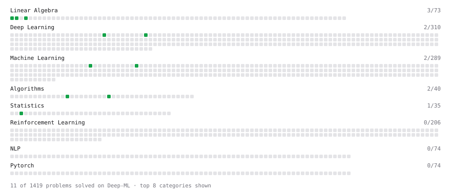

# Deep-ML

My machine learning practice from [Deep-ML](https://www.deep-ml.com). Every solution here was written by hand.

**37** solved · 37 problems · 0 labs · 0 math

[**Browse the interactive portfolio**](https://sristtiii.github.io/deep-ml/) to replay this filling in over time.

## Problems

| | Difficulty | Solved | |
| --- | --- | --- | --- |
| [Calculate 2x2 Matrix Inverse](https://www.deep-ml.com/problems/8) | easy | 2026-07-12 | [solution](problems/0008-calculate-2x2-matrix-inverse) |
| [Calculate Cosine Similarity Between Vectors](https://www.deep-ml.com/problems/76) | easy | 2026-07-20 | [solution](problems/0076-calculate-cosine-similarity-between-vectors) |
| [Calculate Covariance Matrix](https://www.deep-ml.com/problems/10) | easy | 2026-07-13 | [solution](problems/0010-calculate-covariance-matrix) |
| [Calculate Dice Score for Classification](https://www.deep-ml.com/problems/73) | easy | 2026-09-19 | [solution](problems/0073-calculate-dice-score-for-classification) |
| [Calculate Mean Absolute Error (MAE)](https://www.deep-ml.com/problems/93) | easy | 2026-07-20 | [solution](problems/0093-calculate-mean-absolute-error-mae) |
| [Calculate Mean by Row or Column](https://www.deep-ml.com/problems/4) | easy | 2026-07-03 | [solution](problems/0004-calculate-mean-by-row-or-column) |
| [Calculate the Phi Coefficient](https://www.deep-ml.com/problems/95) | easy | 2026-09-21 | [solution](problems/0095-calculate-the-phi-coefficient) |
| [Compute the Cross Product of Two 3D Vectors](https://www.deep-ml.com/problems/118) | easy | 2026-07-20 | [solution](problems/0118-compute-the-cross-product-of-two-3d-vectors) |
| [Count Words Appearing Exactly Once in Each of Two Lists](https://www.deep-ml.com/problems/1141) | easy | 2026-09-16 | [solution](problems/1141-count-words-appearing-exactly-once-in-each-of-two-lists) |
| [Derivative of a Polynomial](https://www.deep-ml.com/problems/116) | easy | 2026-06-23 | [solution](problems/0116-derivative-of-a-polynomial) |
| [Derivatives of Activation Functions](https://www.deep-ml.com/problems/217) | easy | 2026-07-20 | [solution](problems/0217-derivatives-of-activation-functions) |
| [Dot Product Calculator](https://www.deep-ml.com/problems/83) | easy | 2026-07-20 | [solution](problems/0083-dot-product-calculator) |
| [Gradient Direction and Magnitude](https://www.deep-ml.com/problems/308) | easy | 2026-07-17 | [solution](problems/0308-gradient-direction-and-magnitude) |
| [Implement Global Average Pooling](https://www.deep-ml.com/problems/114) | easy | 2026-09-18 | [solution](problems/0114-implement-global-average-pooling) |
| [Implement ReLU Activation Function](https://www.deep-ml.com/problems/42) | easy | 2026-07-20 | [solution](problems/0042-implement-relu-activation-function) |
| [Implement the Hard Sigmoid Activation Function](https://www.deep-ml.com/problems/96) | easy | 2026-09-15 | [solution](problems/0096-implement-the-hard-sigmoid-activation-function) |
| [Linear Kernel Function](https://www.deep-ml.com/problems/45) | easy | 2026-09-19 | [solution](problems/0045-linear-kernel-function) |
| [Linear Regression Using Gradient Descent](https://www.deep-ml.com/problems/15) | easy | 2026-07-15 | [solution](problems/0015-linear-regression-using-gradient-descent) |
| [Linear Regression Using Normal Equation](https://www.deep-ml.com/problems/14) | easy | 2026-07-14 | [solution](problems/0014-linear-regression-using-normal-equation) |
| [Matrix-Vector Dot Product](https://www.deep-ml.com/problems/1) | easy | 2026-07-02 | [solution](problems/0001-matrix-vector-dot-product) |
| [Reshape Matrix](https://www.deep-ml.com/problems/3) | easy | 2026-07-04 | [solution](problems/0003-reshape-matrix) |
| [Scalar Multiplication of a Matrix](https://www.deep-ml.com/problems/5) | easy | 2026-07-05 | [solution](problems/0005-scalar-multiplication-of-a-matrix) |
| [Single Neuron](https://www.deep-ml.com/problems/24) | easy | 2026-07-18 | [solution](problems/0024-single-neuron) |
| [Transpose of a Matrix](https://www.deep-ml.com/problems/2) | easy | 2026-07-01 | [solution](problems/0002-transpose-of-a-matrix) |
| [Valid Palindrome II (Delete At Most One Char)](https://www.deep-ml.com/problems/1160) | easy | 2026-09-17 | [solution](problems/1160-valid-palindrome-ii-delete-at-most-one-char) |
| [Vector Element-wise Sum](https://www.deep-ml.com/problems/121) | easy | 2026-07-20 | [solution](problems/0121-vector-element-wise-sum) |
| [Vector Norms (L1/L2/L-inf) and the Frobenius Norm](https://www.deep-ml.com/problems/328) | easy | 2026-07-20 | [solution](problems/0328-vector-norms-l1-l2-l-inf-and-the-frobenius-norm) |
| [Calculate Eigenvalues of a Matrix](https://www.deep-ml.com/problems/6) | medium | 2026-07-12 | [solution](problems/0006-calculate-eigenvalues-of-a-matrix) |
| [Chain Rule for Composite Functions](https://www.deep-ml.com/problems/214) | medium | 2026-07-20 | [solution](problems/0214-chain-rule-for-composite-functions) |
| [Compute the Hessian Matrix](https://www.deep-ml.com/problems/218) | medium | 2026-07-20 | [solution](problems/0218-compute-the-hessian-matrix) |
| [Derivative of Softmax](https://www.deep-ml.com/problems/219) | medium | 2026-07-20 | [solution](problems/0219-derivative-of-softmax) |
| [Jacobian Matrix Calculation](https://www.deep-ml.com/problems/202) | medium | 2026-07-20 | [solution](problems/0202-jacobian-matrix-calculation) |
| [Matrix times Matrix ](https://www.deep-ml.com/problems/9) | medium | 2026-07-12 | [solution](problems/0009-matrix-times-matrix) |
| [Matrix Transformation ](https://www.deep-ml.com/problems/7) | medium | 2026-07-12 | [solution](problems/0007-matrix-transformation) |
| [Partial Derivatives of Multivariable Functions](https://www.deep-ml.com/problems/215) | medium | 2026-07-19 | [solution](problems/0215-partial-derivatives-of-multivariable-functions) |
| [Product Rule for Derivatives](https://www.deep-ml.com/problems/309) | medium | 2026-07-16 | [solution](problems/0309-product-rule-for-derivatives) |
| [Quotient Rule for Derivatives](https://www.deep-ml.com/problems/312) | medium | 2026-07-16 | [solution](problems/0312-quotient-rule-for-derivatives) |

---

_This file is regenerated by Deep-ML on every push._
