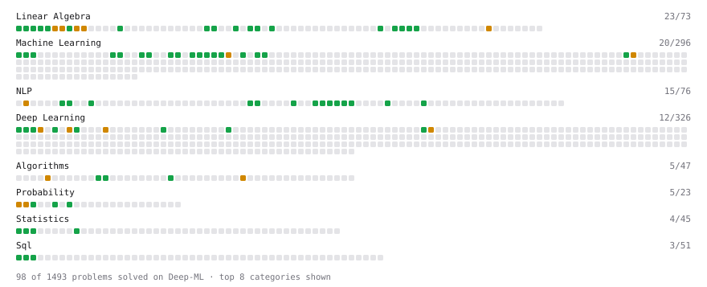

# Deep-ML

My machine learning practice from [Deep-ML](https://www.deep-ml.com). Every solution here was written by hand.

**109** solved · 101 problems · 0 labs · 8 math

[**Browse the interactive portfolio**](https://sristtiii.github.io/deep-ml/) to replay this filling in over time.

## Problems

| | Difficulty | Solved | |
| --- | --- | --- | --- |
| [Binary Classification with Logistic Regression](https://www.deep-ml.com/problems/104) | easy | 2026-08-16 | [solution](problems/0104-binary-classification-with-logistic-regression) |
| [Build Vocabulary from Token List](https://www.deep-ml.com/problems/941) | easy | 2026-09-06 | [solution](problems/0941-build-vocabulary-from-token-list) |
| [Calculate 2x2 Matrix Inverse](https://www.deep-ml.com/problems/8) | easy | 2026-07-12 | [solution](problems/0008-calculate-2x2-matrix-inverse) |
| [Calculate Accuracy Score](https://www.deep-ml.com/problems/36) | easy | 2026-08-02 | [solution](problems/0036-calculate-accuracy-score) |
| [Calculate Conditional Probability from Data](https://www.deep-ml.com/problems/168) | easy | 2026-08-01 | [solution](problems/0168-calculate-conditional-probability-from-data) |
| [Calculate Cosine Similarity Between Vectors](https://www.deep-ml.com/problems/76) | easy | 2026-07-20 | [solution](problems/0076-calculate-cosine-similarity-between-vectors) |
| [Calculate Covariance Matrix](https://www.deep-ml.com/problems/10) | easy | 2026-07-13 | [solution](problems/0010-calculate-covariance-matrix) |
| [Calculate Dice Score for Classification](https://www.deep-ml.com/problems/73) | easy | 2026-09-19 | [solution](problems/0073-calculate-dice-score-for-classification) |
| [Calculate F1 Score from Predicted and True Labels](https://www.deep-ml.com/problems/91) | easy | 2026-08-31 | [solution](problems/0091-calculate-f1-score-from-predicted-and-true-labels) |
| [Calculate Jaccard Index for Binary Classification](https://www.deep-ml.com/problems/72) | easy | 2026-09-01 | [solution](problems/0072-calculate-jaccard-index-for-binary-classification) |
| [Calculate Mean Absolute Error (MAE)](https://www.deep-ml.com/problems/93) | easy | 2026-07-20 | [solution](problems/0093-calculate-mean-absolute-error-mae) |
| [Calculate Mean by Row or Column](https://www.deep-ml.com/problems/4) | easy | 2026-07-03 | [solution](problems/0004-calculate-mean-by-row-or-column) |
| [Calculate P50/P95/P99 Latency Percentiles](https://www.deep-ml.com/problems/293) | easy | 2026-07-22 | [solution](problems/0293-calculate-p50-p95-p99-latency-percentiles) |
| [Calculate Perplexity for Language Models](https://www.deep-ml.com/problems/320) | easy | 2026-08-22 | [solution](problems/0320-calculate-perplexity-for-language-models) |
| [Calculate R-squared for Regression Analysis](https://www.deep-ml.com/problems/69) | easy | 2026-08-15 | [solution](problems/0069-calculate-r-squared-for-regression-analysis) |
| [Calculate Root Mean Square Error (RMSE)](https://www.deep-ml.com/problems/71) | easy | 2026-08-15 | [solution](problems/0071-calculate-root-mean-square-error-rmse) |
| [Calculate the Phi Coefficient](https://www.deep-ml.com/problems/95) | easy | 2026-09-21 | [solution](problems/0095-calculate-the-phi-coefficient) |
| [Calculate Unigram Probability from Corpus](https://www.deep-ml.com/problems/129) | easy | 2026-08-17 | [solution](problems/0129-calculate-unigram-probability-from-corpus) |
| [Calculate Vocabulary Size from Token List](https://www.deep-ml.com/problems/953) | easy | 2026-08-17 | [solution](problems/0953-calculate-vocabulary-size-from-token-list) |
| [Compute Discounted Return](https://www.deep-ml.com/problems/165) | easy | 2026-09-28 | [solution](problems/0165-compute-discounted-return) |
| [Compute the Cross Product of Two 3D Vectors](https://www.deep-ml.com/problems/118) | easy | 2026-07-20 | [solution](problems/0118-compute-the-cross-product-of-two-3d-vectors) |
| [Convert Vector to Diagonal Matrix](https://www.deep-ml.com/problems/35) | easy | 2026-08-08 | [solution](problems/0035-convert-vector-to-diagonal-matrix) |
| [Count Words Appearing Exactly Once in Each of Two Lists](https://www.deep-ml.com/problems/1141) | easy | 2026-09-16 | [solution](problems/1141-count-words-appearing-exactly-once-in-each-of-two-lists) |
| [Derivative of a Polynomial](https://www.deep-ml.com/problems/116) | easy | 2026-06-23 | [solution](problems/0116-derivative-of-a-polynomial) |
| [Derivatives of Activation Functions](https://www.deep-ml.com/problems/217) | easy | 2026-07-20 | [solution](problems/0217-derivatives-of-activation-functions) |
| [Descriptive Statistics Calculator](https://www.deep-ml.com/problems/78) | easy | 2026-07-22 | [solution](problems/0078-descriptive-statistics-calculator) |
| [Dot Product Calculator](https://www.deep-ml.com/problems/83) | easy | 2026-07-20 | [solution](problems/0083-dot-product-calculator) |
| [Duplicated N-gram Coverage Ratio](https://www.deep-ml.com/problems/772) | easy | 2026-09-11 | [solution](problems/0772-duplicated-n-gram-coverage-ratio) |
| [Exact Match Score with Normalization](https://www.deep-ml.com/problems/325) | easy | 2026-08-22 | [solution](problems/0325-exact-match-score-with-normalization) |
| [Expected Value and Variance of an n-Sided Die](https://www.deep-ml.com/problems/179) | easy | 2026-07-23 | [solution](problems/0179-expected-value-and-variance-of-an-n-sided-die) |
| [Feature Scaling Implementation](https://www.deep-ml.com/problems/16) | easy | 2026-08-03 | [solution](problems/0016-feature-scaling-implementation) |
| [Filter rows with WHERE](https://www.deep-ml.com/problems/1103) | easy | 2026-09-30 | [solution](problems/1103-filter-rows-with-where) |
| [Find Most Frequent Token Pair for BPE](https://www.deep-ml.com/problems/948) | easy | 2026-09-09 | [solution](problems/0948-find-most-frequent-token-pair-for-bpe) |
| [Generate a Confusion Matrix for Binary Classification](https://www.deep-ml.com/problems/75) | easy | 2026-08-15 | [solution](problems/0075-generate-a-confusion-matrix-for-binary-classification) |
| [Gradient Direction and Magnitude](https://www.deep-ml.com/problems/308) | easy | 2026-07-17 | [solution](problems/0308-gradient-direction-and-magnitude) |
| [Implement F-Score Calculation for Binary Classification](https://www.deep-ml.com/problems/61) | easy | 2026-08-09 | [solution](problems/0061-implement-f-score-calculation-for-binary-classification) |
| [Implement Global Average Pooling](https://www.deep-ml.com/problems/114) | easy | 2026-09-18 | [solution](problems/0114-implement-global-average-pooling) |
| [Implement Precision Metric](https://www.deep-ml.com/problems/46) | easy | 2026-08-12 | [solution](problems/0046-implement-precision-metric) |
| [Implement Recall Metric in Binary Classification](https://www.deep-ml.com/problems/52) | easy | 2026-08-12 | [solution](problems/0052-implement-recall-metric-in-binary-classification) |
| [Implement ReLU Activation Function](https://www.deep-ml.com/problems/42) | easy | 2026-07-20 | [solution](problems/0042-implement-relu-activation-function) |
| [Implement the Hard Sigmoid Activation Function](https://www.deep-ml.com/problems/96) | easy | 2026-09-15 | [solution](problems/0096-implement-the-hard-sigmoid-activation-function) |
| [Implementation of Log Softmax Function](https://www.deep-ml.com/problems/39) | easy | 2026-08-10 | [solution](problems/0039-implementation-of-log-softmax-function) |
| [Instruction Complexity Scoring via Unique Intention Tags](https://www.deep-ml.com/problems/792) | easy | 2026-09-10 | [solution](problems/0792-instruction-complexity-scoring-via-unique-intention-tags) |
| [L2 Normalization Along an Axis](https://www.deep-ml.com/problems/1022) | easy | 2026-09-07 | [solution](problems/1022-l2-normalization-along-an-axis) |
| [Laplace Smoothing for Bigram Probabilities](https://www.deep-ml.com/problems/987) | easy | 2026-09-22 | [solution](problems/0987-laplace-smoothing-for-bigram-probabilities) |
| [Linear Kernel Function](https://www.deep-ml.com/problems/45) | easy | 2026-09-19 | [solution](problems/0045-linear-kernel-function) |
| [Linear Regression Using Gradient Descent](https://www.deep-ml.com/problems/15) | easy | 2026-07-15 | [solution](problems/0015-linear-regression-using-gradient-descent) |
| [Linear Regression Using Normal Equation](https://www.deep-ml.com/problems/14) | easy | 2026-07-14 | [solution](problems/0014-linear-regression-using-normal-equation) |
| [Matrix Determinant & Trace](https://www.deep-ml.com/problems/195) | easy | 2026-08-21 | [solution](problems/0195-matrix-determinant-trace) |
| [Matrix-Vector Dot Product](https://www.deep-ml.com/problems/1) | easy | 2026-07-02 | [solution](problems/0001-matrix-vector-dot-product) |
| [Min-Max Scaling of Feature Values](https://www.deep-ml.com/problems/112) | easy | 2026-08-30 | [solution](problems/0112-min-max-scaling-of-feature-values) |
| [One-Hot Encoding of Nominal Values](https://www.deep-ml.com/problems/34) | easy | 2026-08-03 | [solution](problems/0034-one-hot-encoding-of-nominal-values) |
| [Poisson Distribution Probability Calculator](https://www.deep-ml.com/problems/81) | easy | 2026-08-13 | [solution](problems/0081-poisson-distribution-probability-calculator) |
| [Prompt Complexity Scoring via Intention Tag Count](https://www.deep-ml.com/problems/774) | easy | 2026-09-24 | [solution](problems/0774-prompt-complexity-scoring-via-intention-tag-count) |
| [Regex-Based Text Tokenizer](https://www.deep-ml.com/problems/940) | easy | 2026-08-17 | [solution](problems/0940-regex-based-text-tokenizer) |
| [Remove duplicates with DISTINCT](https://www.deep-ml.com/problems/1105) | easy | 2026-10-04 | [solution](problems/1105-remove-duplicates-with-distinct) |
| [Reshape Matrix](https://www.deep-ml.com/problems/3) | easy | 2026-07-04 | [solution](problems/0003-reshape-matrix) |
| [Scalar Multiplication of a Matrix](https://www.deep-ml.com/problems/5) | easy | 2026-07-05 | [solution](problems/0005-scalar-multiplication-of-a-matrix) |
| [SELECT all rows](https://www.deep-ml.com/problems/1101) | easy | 2026-09-29 | [solution](problems/1101-select-all-rows) |
| [Select specific columns](https://www.deep-ml.com/problems/1102) | easy | 2026-10-01 | [solution](problems/1102-select-specific-columns) |
| [Sigmoid Activation Function Understanding](https://www.deep-ml.com/problems/22) | easy | 2026-08-10 | [solution](problems/0022-sigmoid-activation-function-understanding) |
| [Simple Word Tokenizer Encode and Decode](https://www.deep-ml.com/problems/942) | easy | 2026-09-05 | [solution](problems/0942-simple-word-tokenizer-encode-and-decode) |
| [Single Neuron](https://www.deep-ml.com/problems/24) | easy | 2026-07-18 | [solution](problems/0024-single-neuron) |
| [Sliding Window Text Dataset Generator](https://www.deep-ml.com/problems/944) | easy | 2026-09-08 | [solution](problems/0944-sliding-window-text-dataset-generator) |
| [Softmax Activation Function Implementation ](https://www.deep-ml.com/problems/23) | easy | 2026-08-10 | [solution](problems/0023-softmax-activation-function-implementation) |
| [Sort results with ORDER BY](https://www.deep-ml.com/problems/1104) | easy | 2026-10-02 | [solution](problems/1104-sort-results-with-order-by) |
| [Tensor Puzzle: Extract the Diagonal](https://www.deep-ml.com/problems/1271) | easy | 2026-09-03 | [solution](problems/1271-tensor-puzzle-extract-the-diagonal) |
| [Tensor Puzzle: Ones Vector from First Principles](https://www.deep-ml.com/problems/1268) | easy | 2026-09-02 | [solution](problems/1268-tensor-puzzle-ones-vector-from-first-principles) |
| [Tensor Puzzle: Outer Product via Broadcasting](https://www.deep-ml.com/problems/1270) | easy | 2026-09-03 | [solution](problems/1270-tensor-puzzle-outer-product-via-broadcasting) |
| [Tensor Puzzle: Sum a Vector with a Dot Product](https://www.deep-ml.com/problems/1269) | easy | 2026-09-03 | [solution](problems/1269-tensor-puzzle-sum-a-vector-with-a-dot-product) |
| [Tokenizer with Unknown and End-of-Text Tokens](https://www.deep-ml.com/problems/943) | easy | 2026-08-19 | [solution](problems/0943-tokenizer-with-unknown-and-end-of-text-tokens) |
| [Top-K Largest Elements in a List](https://www.deep-ml.com/problems/1137) | easy | 2026-09-12 | [solution](problems/1137-top-k-largest-elements-in-a-list) |
| [Transpose of a Matrix](https://www.deep-ml.com/problems/2) | easy | 2026-07-01 | [solution](problems/0002-transpose-of-a-matrix) |
| [Upper Confidence Bound (UCB) Action Selection](https://www.deep-ml.com/problems/162) | easy | 2026-09-26 | [solution](problems/0162-upper-confidence-bound-ucb-action-selection) |
| [Valid Palindrome II (Delete At Most One Char)](https://www.deep-ml.com/problems/1160) | easy | 2026-09-17 | [solution](problems/1160-valid-palindrome-ii-delete-at-most-one-char) |
| [Vector Element-wise Sum](https://www.deep-ml.com/problems/121) | easy | 2026-07-20 | [solution](problems/0121-vector-element-wise-sum) |
| [Vector Norms (L1/L2/L-inf) and the Frobenius Norm](https://www.deep-ml.com/problems/328) | easy | 2026-07-20 | [solution](problems/0328-vector-norms-l1-l2-l-inf-and-the-frobenius-norm) |
| [Best Meeting Point on a 2D Grid](https://www.deep-ml.com/problems/1085) | medium | 2026-09-14 | [solution](problems/1085-best-meeting-point-on-a-2d-grid) |
| [Binomial Distribution Probability](https://www.deep-ml.com/problems/79) | medium | 2026-08-13 | [solution](problems/0079-binomial-distribution-probability) |
| [Calculate Eigenvalues of a Matrix](https://www.deep-ml.com/problems/6) | medium | 2026-07-12 | [solution](problems/0006-calculate-eigenvalues-of-a-matrix) |
| [Calculate Performance Metrics for a Classification Model](https://www.deep-ml.com/problems/77) | medium | 2026-08-15 | [solution](problems/0077-calculate-performance-metrics-for-a-classification-model) |
| [Chain Rule for Composite Functions](https://www.deep-ml.com/problems/214) | medium | 2026-07-20 | [solution](problems/0214-chain-rule-for-composite-functions) |
| [Compute the Hessian Matrix](https://www.deep-ml.com/problems/218) | medium | 2026-07-20 | [solution](problems/0218-compute-the-hessian-matrix) |
| [Derivative of Cross-Entropy Loss w.r.t. Logits](https://www.deep-ml.com/problems/220) | medium | 2026-07-21 | [solution](problems/0220-derivative-of-cross-entropy-loss-w-r-t-logits) |
| [Derivative of Softmax](https://www.deep-ml.com/problems/219) | medium | 2026-07-20 | [solution](problems/0219-derivative-of-softmax) |
| [Implement TF-IDF (Term Frequency-Inverse Document Frequency)](https://www.deep-ml.com/problems/60) | medium | 2026-09-23 | [solution](problems/0060-implement-tf-idf-term-frequency-inverse-document-frequency) |
| [Implementing a Simple RNN](https://www.deep-ml.com/problems/54) | medium | 2026-08-11 | [solution](problems/0054-implementing-a-simple-rnn) |
| [Jacobian Matrix Calculation](https://www.deep-ml.com/problems/202) | medium | 2026-07-20 | [solution](problems/0202-jacobian-matrix-calculation) |
| [Matrix times Matrix ](https://www.deep-ml.com/problems/9) | medium | 2026-07-12 | [solution](problems/0009-matrix-times-matrix) |
| [Matrix Transformation ](https://www.deep-ml.com/problems/7) | medium | 2026-07-12 | [solution](problems/0007-matrix-transformation) |
| [Multi-Source BFS: Time to Fill a Grid](https://www.deep-ml.com/problems/1246) | medium | 2026-10-03 | [solution](problems/1246-multi-source-bfs-time-to-fill-a-grid) |
| [Normal Distribution PDF Calculator](https://www.deep-ml.com/problems/80) | medium | 2026-08-14 | [solution](problems/0080-normal-distribution-pdf-calculator) |
| [Number of Islands (Grid Connected Components)](https://www.deep-ml.com/problems/1186) | medium | 2026-09-13 | [solution](problems/1186-number-of-islands-grid-connected-components) |
| [Outlier Detection and Removal Using IQR Method](https://www.deep-ml.com/problems/355) | medium | 2026-08-30 | [solution](problems/0355-outlier-detection-and-removal-using-iqr-method) |
| [Partial Derivatives of Multivariable Functions](https://www.deep-ml.com/problems/215) | medium | 2026-07-19 | [solution](problems/0215-partial-derivatives-of-multivariable-functions) |
| [Product Rule for Derivatives](https://www.deep-ml.com/problems/309) | medium | 2026-07-16 | [solution](problems/0309-product-rule-for-derivatives) |
| [Quotient Rule for Derivatives](https://www.deep-ml.com/problems/312) | medium | 2026-07-16 | [solution](problems/0312-quotient-rule-for-derivatives) |
| [Simple Convolutional 2D Layer](https://www.deep-ml.com/problems/41) | medium | 2026-08-10 | [solution](problems/0041-simple-convolutional-2d-layer) |
| [Single Neuron with Backpropagation](https://www.deep-ml.com/problems/25) | medium | 2026-08-04 | [solution](problems/0025-single-neuron-with-backpropagation) |
| [Solve Linear Equations using Jacobi Method](https://www.deep-ml.com/problems/11) | medium | 2026-08-05 | [solution](problems/0011-solve-linear-equations-using-jacobi-method) |
| [Tensor Puzzle: Bincount by Scatter-Add](https://www.deep-ml.com/problems/1282) | medium | 2026-09-04 | [solution](problems/1282-tensor-puzzle-bincount-by-scatter-add) |

## Math

| | Difficulty | Solved | |
| --- | --- | --- | --- |
| [Derivatives and Gradients](https://www.deep-ml.com/math-problems/1) | easy | 2026-09-28 | [solution](math/0001-derivatives-and-gradients) |
| [Descriptive Statistics](https://www.deep-ml.com/math-problems/18) | easy | 2026-09-28 | [solution](math/0018-descriptive-statistics) |
| [Probability Fundamentals](https://www.deep-ml.com/math-problems/19) | easy | 2026-09-28 | [solution](math/0019-probability-fundamentals) |
| [Vector Operations](https://www.deep-ml.com/math-problems/7) | easy | 2026-09-28 | [solution](math/0007-vector-operations) |
| [Backpropagation and the Chain Rule](https://www.deep-ml.com/math-problems/4) | medium | 2026-08-04 | [solution](math/0004-backpropagation-and-the-chain-rule) |
| [Multivariate Calculus](https://www.deep-ml.com/math-problems/2) | medium | 2026-09-28 | [solution](math/0002-multivariate-calculus) |
| [Neural Network Derivatives](https://www.deep-ml.com/math-problems/3) | medium | 2026-09-28 | [solution](math/0003-neural-network-derivatives) |
| [Vector Norms and Linear Independence](https://www.deep-ml.com/math-problems/8) | medium | 2026-09-28 | [solution](math/0008-vector-norms-and-linear-independence) |

---

_This file is regenerated by Deep-ML on every push._
